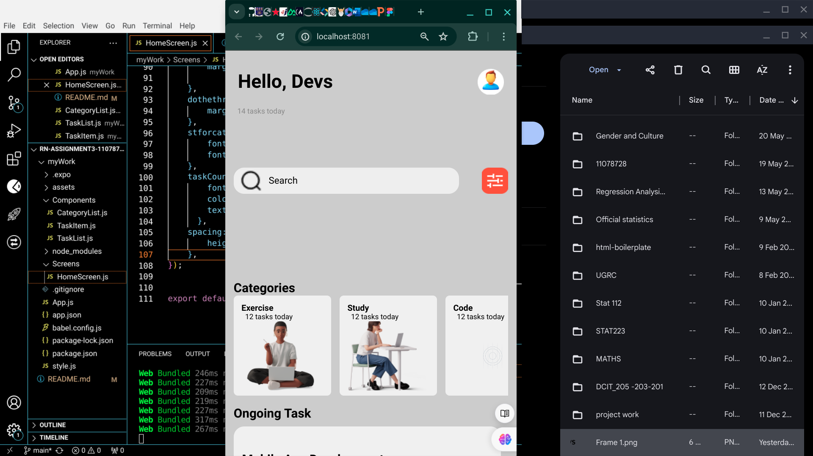

# rn-assignment3-11078728

# Task Management App

A simple task management application built with React Native. 

## Table of Contents

- [Description](#description)
- [Components](#components)
  - [HomeScreen](#homescreen)
  - [CategoryList](#categorylist)
  - [TaskList](#tasklist)
- [Screenshots](#screenshots)
- [Setup](#setup)
- [License](#license)

## Description

This app allows users to manage their daily tasks by adding new tasks, categorizing them, and viewing them in an organized manner. The main features include:

- Adding new tasks.
- Viewing tasks categorized into different groups like Exercise, Study, Code, Cook, etc.
- Viewing a list of ongoing tasks.

## Components

### HomeScreen

The `HomeScreen` component serves as the main screen of the app. It includes the following elements:

- A text input for adding new tasks.
- A horizontal list of categories.
- A vertical list of tasks.

### CategoryList

The `CategoryList` component renders a horizontal list of categories. Each category is displayed inside a box with the category name at the top and an icon below it. Categories include:

- Exercise
- Study
- Code
- Cook
- Read
- Travel
- Relax
- Work

### TaskList

The `TaskList` component renders a vertical list of tasks. Each task is displayed inside a box with the task text. Tasks include:

- Morning Run
- Study Math
- Code React App
- Cook Dinner
- Read Book
- Plan Trip
- Meditate
- Work on Project
- Attend Meeting
- Write Report
- Grocery Shopping
- Clean House
- Exercise at Gym
- Water Plants
- Practice Piano




## Setup

1. Clone the repository:
   ```bash
   git clone https://github.com/pkay28748/rn-assignment3-11078728.git

2.Navigate to the project directory:
    cd rn-assignment3-11078728

3.Install dependencies:
    npm install

4.Start the React Native development server:
    npx react-native start

5.Run the app on your preferred platform (iOS or Android):
    npx react-native run-android
# or
    npx react-native run-ios

## License
This project is licensed under the MIT License - see the LICENSE file for details.

